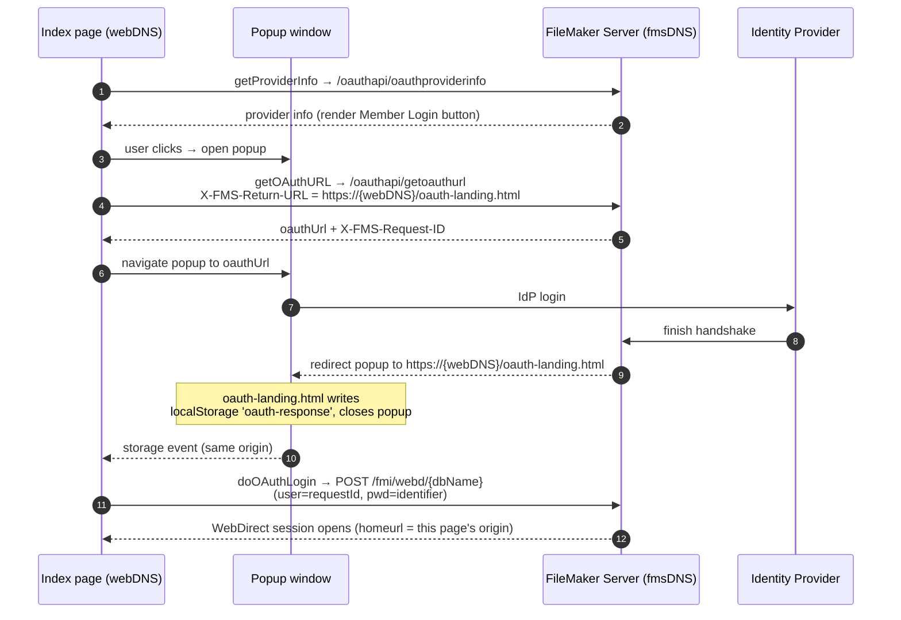
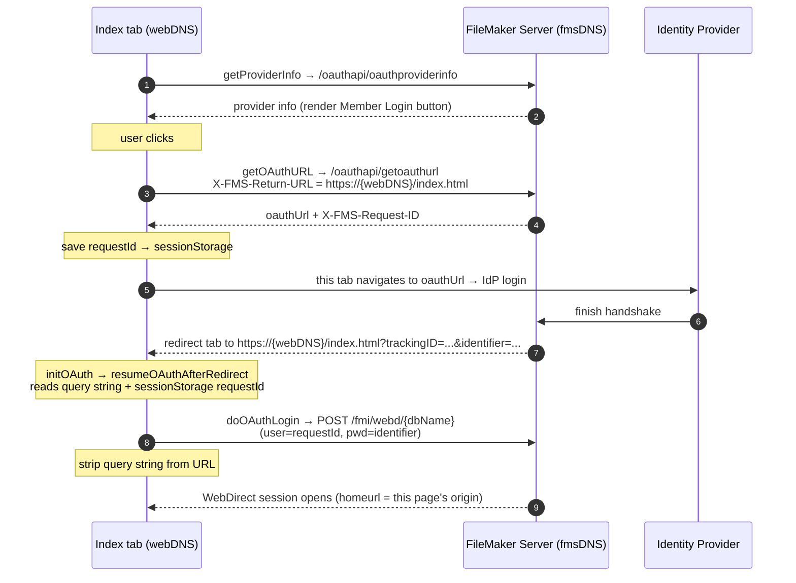

# FileMaker WebDirect custom OAuth login (remote web site)

This sample website shows how you can start the OAuth login flow into a WebDirect file,
right from your own web site, without taking the user to the WebDirect launch center or the
WebDirect file's login screen.

This version is for a web site that does **not** run on FileMaker Server. The web server
(`webDNS`) and the FileMaker Server (`fmsDNS`) are two different boxes. It requires no HTML or
JS files to be installed on FileMaker Server.

It targets the FileMaker Server release where Claris fixed `X-FMS-Return-URL` so that FMS can
return the OAuth result to a cross-origin URL on your own web server. That fix is what makes
the popup flow below work when the files are hosted off-server.

## Which repo do I use?

- **Web site on a separate server, FileMaker Server 26+** (the `X-FMS-Return-URL` fix):
  **this repo**.
- **Web site on a separate server, older FileMaker Server (2025 / FMS22 or earlier):**
  https://github.com/wimdecorte/fms-webd-oauth-remote
  That older setup also needs a companion that **must** run on the FileMaker Server box:
  https://github.com/wimdecorte/fms-webd-oauth-remote-companion
  The companion is required because pre-fix FMS could not return cross-origin, so a helper on
  the FMS origin was needed to relay the OAuth result back to the remote web site.
- **Web site on the FileMaker Server box itself:**
  https://github.com/wimdecorte/fms-webd-oauth-local

This functionality already exists for logging in with regular FileMaker accounts, see:
https://github.com/bharlow/fm-webdirect-custom

## Configuration (`assets/js/oauth-config.js`)

This demo is static HTML and JavaScript; the browser cannot read a `.env` file. Copy
`assets/js/oauth-config.js.example` to `assets/js/oauth-config.js` and edit the values:

| Key | Purpose |
| --- | --- |
| `dbName` | Published WebDirect file name to open after OAuth (no `.fmp12`). |
| `fmsDNS` | FileMaker Server box. Target of all API calls and the login POST. |
| `webDNS` | This web server box. Used for the `X-FMS-Return-URL` in popup mode. The post-login home URL is **not** taken from here — it follows the page's live origin (`window.location.origin`), so the same files work under any allowed host. |
| `identityProvider` | Provider name passed to `getOAuthURL` (must match the FMS OAuth config). |
| `autoStartOAuth` | When `true`, OAuth starts as soon as provider info loads. The Member Login button still shows for manual retry. |
| `useFullPageRedirect` | Switch between popup (`false`, default) and full-page redirect (`true`). |
| `logLevel` | loglevel verbosity: `trace` \| `debug` \| `info` \| `warn` \| `error` \| `silent`. |

## Server-side setup (FileMaker Server)

Because this page lives on `webDNS` and calls FileMaker Server on `fmsDNS`, the browser treats
those calls as **cross-origin**. FileMaker Server must be configured to allow them, or the login
never starts. **Do these steps in order on the FMS host** (the order matters — the CORS script
reads the allowed domains *from* FMS, so FMS is configured first):

1. **OAuth Allow List** — Admin Console → **Administration → External Authentication → OAuth Allow
   List**: enable it and add each `webDNS` origin (e.g. `wim.ets.fm`, and others if several sites
   share this server).
2. **Custom Home URL** — Admin Console → **Connectors → Web Publishing → Claris FileMaker
   WebDirect**: set to `https://<webDNS>` (the OAuth return URL FMS will honor).
3. **CORS policy** — run [`scripts/patch-fms-nginx-cors.sh`](scripts/patch-fms-nginx-cors.sh) on
   the FMS box. With no arguments it defaults to `--from-fms`, deriving the nginx CORS allowlist
   from step 1 so the two layers stay in sync:
   ```bash
   sudo ./patch-fms-nginx-cors.sh --dry-run   # preview
   sudo ./patch-fms-nginx-cors.sh             # apply (default = --from-fms)
   ```
   (For a one-off single origin: `sudo ./patch-fms-nginx-cors.sh https://<webDNS>`. Wildcard
   `'*'` is demo-only.)
4. **Syntax-check + restart** — `sudo ./patch-fms-nginx-cors.sh --nginx-test --passphrase ''`
   (empty passphrase for a no-passphrase key), then `fmsadmin restart httpserver`.

The script is re-runnable and idempotent — worth keeping because **FMS regenerates its nginx
config on upgrade**, reverting the CORS block to stock; just re-run step 3. See
[`docs/fms-server-cors-config.md`](docs/fms-server-cors-config.md) for the full walkthrough
(Quick start at the top), the by-hand alternative, and troubleshooting.

## Debug logging

Logging uses the [loglevel](https://github.com/pimterry/loglevel) library, loaded from a CDN
in [`index.html`](index.html). On startup, [`assets/js/oauth-index.js`](assets/js/oauth-index.js)
calls `log.setLevel(OAUTH_CONFIG.logLevel)` and then logs the resolved configuration with
`log.debug('config:', OAUTH_CONFIG)`.

- **Where the logs go:** the **browser's DevTools console** — this is client-side
  JavaScript, so there is **no server-side log file** for it. Open DevTools (F12, or
  right-click → Inspect → Console) on the page to see them.
- **The popup has its own console.** In popup mode the IdP login and `oauth-landing.html`
  run in the popup window; open DevTools *in that popup* to see its messages. (The popup
  closes itself on success, so set a breakpoint or use "Preserve log" if you need to inspect
  it after it closes.)
- **Verbosity** is controlled entirely by `logLevel` in `oauth-config.js`. Set it to
  `'debug'` (or `'trace'`) while testing to see the config dump; set it to `'silent'` to
  turn logging off in production.
- **Add your own messages** by calling `log.debug(...)` / `log.info(...)` etc. in the OAuth
  JS files — they will honor the same `logLevel`.
- **Not the same as the web server logs.** When you run the test container (below), nginx's
  own access/error logs go to the container's stdout/stderr — view them with
  `podman logs <container>`. That is separate from the in-browser loglevel output above.

## The two modes (`useFullPageRedirect`)

Both modes run the same OAuth: `getOAuthURL` on FileMaker Server, the user signs in at the
identity provider, and FileMaker Server completes the handshake. They differ only in **where**
FMS sends the result, set via `X-FMS-Return-URL` on the `getOAuthURL` call (see
[`assets/js/oauth-utility-edit.js`](assets/js/oauth-utility-edit.js), `getOAuthReturnUrl`).

- **`false` (default) — popup mode**
  `X-FMS-Return-URL = https://<webDNS>/oauth-landing.html`
  The index page stays open and opens a popup for the IdP login. When FMS returns the popup
  to `oauth-landing.html` (same origin as the index page, on `webDNS`), that page writes the
  result to `localStorage` and the index page hears the `storage` event.

- **`true` — full-page mode**
  `X-FMS-Return-URL =` the index page's own URL on `webDNS`
  The index tab itself navigates to the IdP (no popup). The request id is saved in
  `sessionStorage` first. FMS returns the tab to the index URL with the result in the query
  string; `resumeOAuthAfterRedirect` reads it and completes the login, then the query string
  is stripped from the address bar.

### Popup mode flow



### Full-page mode flow



## Local testing with Podman

A throwaway container (Ubuntu + nginx) serves these files over HTTPS on the `webDNS`
hostname so the OAuth flow can be tested end to end. It serves files only; it changes
nothing on FileMaker Server.

Build and run:

```bash
./container/run.sh
```

This builds the image and runs nginx with the repo mounted read-only, published on port
443, with `WEBDNS` defaulting to `webdlogin.ets.fm`. Override the hostname with:

```bash
WEBDNS=my-web-host.example.com ./container/run.sh
```

Make the hostname resolve to your machine. Add to `/etc/hosts` (or use real DNS):

```
127.0.0.1 webdlogin.ets.fm
```

Keep `webDNS` in `assets/js/oauth-config.js` matching this hostname. Then open
`https://webdlogin.ets.fm`. Edits to the repo files show on a browser refresh (the files are
mounted, not baked in).

### About the SSL certificate

The container generates a self-signed certificate at startup for whatever `WEBDNS` you pass,
so the certificate always matches the hostname. Your browser will show a one-time "not
trusted" warning; accepting it is safe here. Only the browser ever sees this certificate: the
identity provider redirects to FileMaker Server (`fmsDNS`), and FileMaker Server sends the
browser a redirect (302) to the return URL on `webDNS` — neither the IdP nor FileMaker Server
validates the `webDNS` certificate.

To avoid the warning entirely, use your own certificate: put the cert and key in a directory
and point `CERT_DIR` at it, e.g.

```bash
CERT_DIR=/path/to/certs ./container/run.sh
```

`run.sh` mounts that directory at `/etc/nginx/certs`, and the container uses it instead of
generating one. `CERT_DIR` combines with `WEBDNS` — set both to serve your own cert under a
specific hostname. A few requirements:

- **Exact filenames.** The two files must be named exactly `server.crt` and `server.key`
  (these paths are hardcoded). Anything else is ignored and the container falls back to
  generating a self-signed cert.
- **`server.crt` is the full chain.** nginx serves the file as-is and does not build the
  chain for you, so `server.crt` must contain the leaf certificate first, followed by any
  intermediate(s), concatenated in one PEM file. (For example, Let's Encrypt's
  `fullchain.pem` → `server.crt`, `privkey.pem` → `server.key`.) The root CA is not needed.
- **Valid for the hostname.** The cert must be valid for the `WEBDNS` you browse to — an
  exact-host, wildcard, or multi-domain (SAN) certificate all work, as long as it covers that
  name. (A self-signed cert always matches because it is generated from `WEBDNS`; your own
  cert only matches if you make it.)

Enjoy!

Wim Decorte
Soliant Consulting Inc.

---

Website provided by **Photon by HTML5 UP** ([html5up.net](https://html5up.net) | @ajlkn) —
free for personal and commercial use under the
[CCA 3.0 license](https://html5up.net/license).

A simple (gradient-heavy) single pager that revisits a style I messed with on two previous
designs (Tessellate and Telephasic). Fully responsive, built on Sass, and, as usual, loaded
with an assortment of pre-styled elements. Have fun! :)

Demo images courtesy of [Unsplash](https://unsplash.com), a radtastic collection of CC0
(public domain) images you can use for pretty much whatever. (Not included.)

Feedback, bug reports, and comments are not only welcome, but strongly encouraged :)

AJ — aj@lkn.io | @ajlkn

**Credits:**

- Demo Images: [Unsplash](https://unsplash.com)
- Icons: [Font Awesome](https://fontawesome.io)
- jQuery ([jquery.com](https://jquery.com))
- Responsive Tools ([github.com/ajlkn/responsive-tools](https://github.com/ajlkn/responsive-tools))
